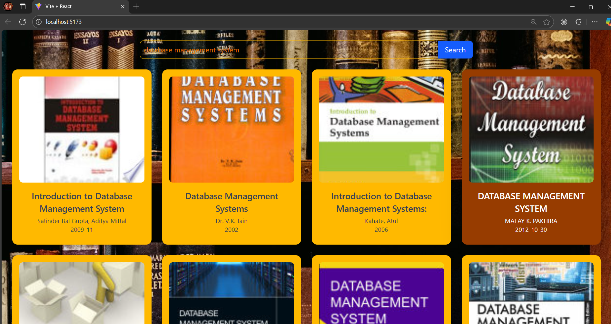
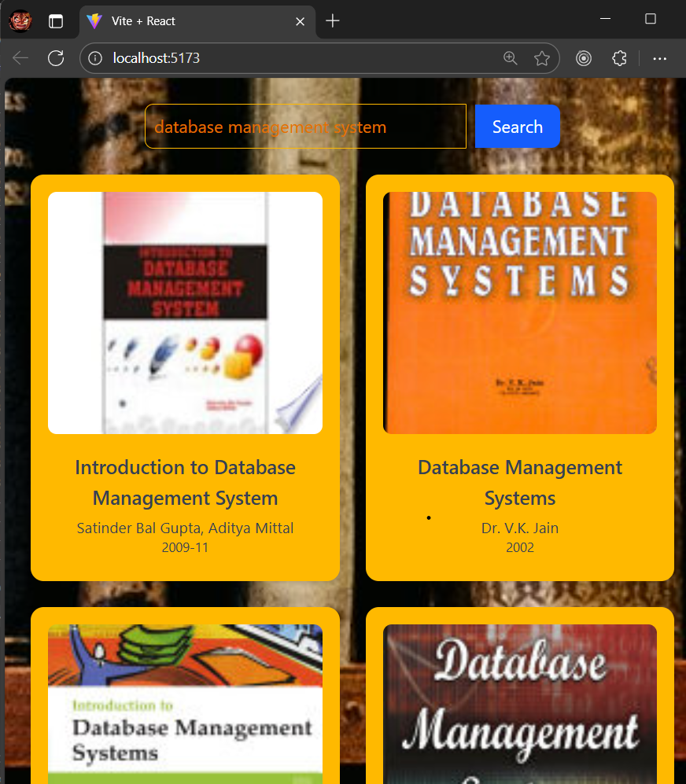
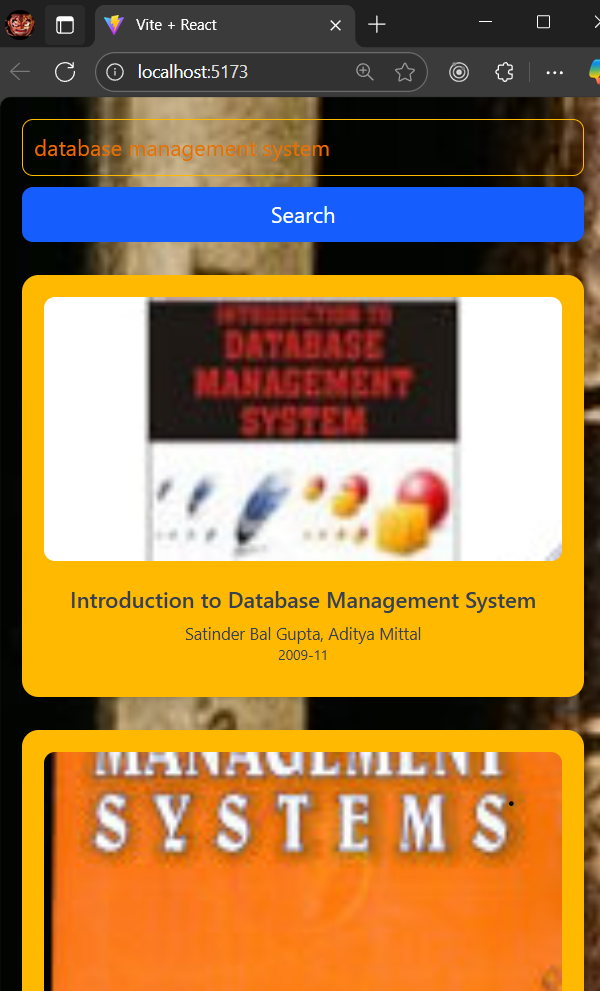

📚 Book Search App

A modern, responsive book search application built with React + Tailwind CSS, powered by the Google Books API.
Search for books by title, author, or keyword, and explore details in a clean, mobile-friendly UI.

🚀 Features

✅ Search books instantly using Google Books API
✅ Responsive design – works seamlessly on mobile, tablet, and desktop
✅ Book cards with details – title, author, publish date, subtitle & thumbnail
✅ Fallback image if book cover is not available
✅ Smooth hover animations for interactive UI
✅ Fast performance thanks to React hooks & modern design

🛠️ Tech Stack

⚛️ React – Component-based UI

🎨 Tailwind CSS – Modern styling & responsiveness

🔍 Google Books API – Fetches real-time book data

🌐 Vercel – For deployment (optional)

📸 Screenshots
Search Page Book Cards

(Replace with real screenshots of your app)

⚙️ Installation & Setup

Clone the repo and run locally:

# 1️⃣ Clone repo

git clone https://github.com/yourusername/book-search-app.git

# 2️⃣ Enter project folder

cd book-search-app

# 3️⃣ Install dependencies

npm install

# 4️⃣ Run locally

npm start

The app will open at http://localhost:3000/
🚀

📡 API Used

This project uses the Google Books API:

https://www.googleapis.com/books/v1/volumes?q=SEARCH_TERM&maxResults=20

🌍 Deployment

Easily deploy on Vercel (free) or Netlify:

# Build for production

npm run build

Upload the /build folder to your hosting service

Or connect your GitHub repo directly to Vercel for auto-deploys

🤝 Contributing

Want to improve this project? Fork the repo and submit a PR!
Suggestions are always welcome 🙌

📬 Contact

👤 Your Name (Vikas Sastiya)
📧 [vikassastiya06@example.com
]

⭐ If you like this project, don’t forget to star the repo to support my work!

👉 Vikas, I can also make a short professional tagline at the top like:
"A clean, fast, and responsive book search app made with React & Tailwind to showcase modern frontend skills."

Do you want me to add a “Why I built this project” section to highlight your motivation (good for recruiters)?
